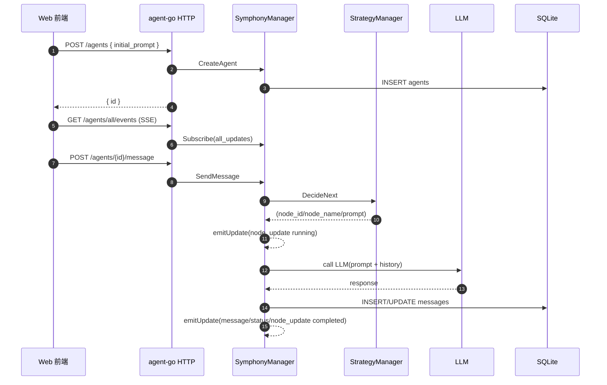
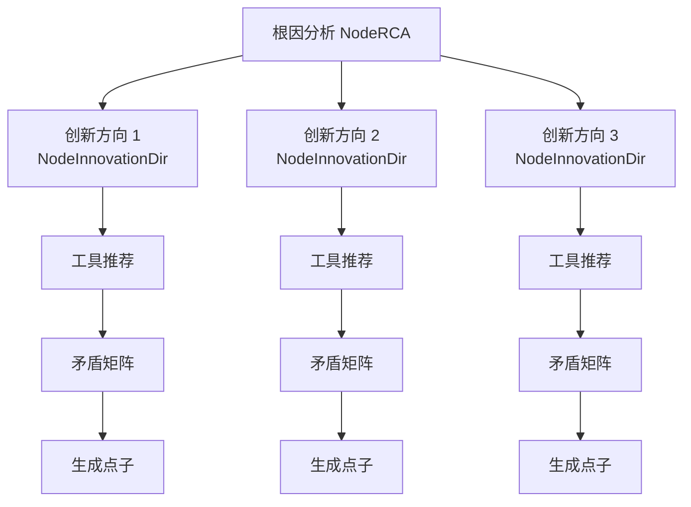

# Symphony Agent (Go) 工程说明

本目录是 Symphony 的 Go 后端实现（agent-go）。它提供 TRIZ 创新工作流的编排与执行、Agent 裂变并行分析、消息与状态持久化、以及面向前端的 HTTP API 与 SSE 实时事件流。

## 核心能力

- TRIZ 工作流编排：按节点（标题生成 → 根因分析 → 工具推荐 → 矛盾矩阵 → 生成点子）推进，节点间支持 I/O 映射与提示词模板。
- 裂变并行：根因分析产出多个“创新方向”后，可裂变出多个子 Agent 并行执行后续分析链路。
- 实时可观测：通过 SSE 实时推送节点流转、消息增量、状态变化、裂变关系等事件，前端可据此绘制执行图谱与日志联动。
- 可恢复：Agent 与消息写入 SQLite，服务重启后可从 DB 恢复历史 Agent 与完整路径消息上下文。
- 多运行模式：支持 server（HTTP API 服务）与 console（交互控制台）两种运行方式。

## 快速启动

### 前台启动（server）

```bash
cd /Users/jack/typescript/opencode/geek_dev/Symphony/agent-go
./start.sh server
```

### 后台启动（server）

```bash
cd /Users/jack/typescript/opencode/geek_dev/Symphony/agent-go
./start-server-bg.sh
tail -f symphony-agent.log
```

### 运行模式说明

- `-mode=server`：启动 HTTP API（默认监听 `config.json -> server.port`，例如 `:4098`）
- `-mode=console`：启动命令行交互控制台

入口见 [main.go](file:///Users/jack/typescript/opencode/geek_dev/Symphony/agent-go/main.go)。

## HTTP API 概览

服务启动见 [server.go](file:///Users/jack/typescript/opencode/geek_dev/Symphony/agent-go/server.go)。

### 生成标题

- `POST /get-title`
- Body: `{ "description": "..." }`
- Response: `{ "title": "...", "agentId": "..." }`

### Agent 列表 / 创建 Agent

- `GET /agents`：返回所有 Agent（内存快照）
- `POST /agents`：创建 Agent
  - Body: `{ "parent_id": "...", "initial_prompt": "..." }`
  - Response: `{ "id": "..." }`

### Agent 详情 / 消息 / 历史 / 事件流

- `GET /agents/{id}`：返回 Agent 状态（含节点/状态/消息等）
- `POST /agents/{id}/message`：向 Agent 发送消息
  - Body: `{ "text": "..." }`
- `GET /agents/{id}/history?include_ancestors=true|false`：获取该 Agent 的“路径历史”（可选包含祖先）
- `GET /agents/{id}/events`：SSE 事件流（该 Agent 专属）
- `GET /agents/all/events`：SSE 全局事件流（所有 Agent 的实时更新）

## SSE 事件模型

后端采用一个轻量 PubSub（内存频道 + buffered channel）推送事件，核心实现在 [manager.go](file:///Users/jack/typescript/opencode/geek_dev/Symphony/agent-go/manager.go)。

### 频道（Topic）

- `update:{agentId}`：某个 Agent 的事件专属频道
- `all_updates`：全局事件频道（前端用于绘制完整执行图谱，避免多连接限制）

### 事件类型（UpdateEvent.type）

结构定义在 [types.go](file:///Users/jack/typescript/opencode/geek_dev/Symphony/agent-go/types.go)：

- `message`：消息更新（含增量拼接后的内容/思考）
- `status`：Agent 状态变更（running/idle 等）
- `title`：标题变更（便于前端任务列表展示）
- `node_update`：节点变更（node_id / node_name / content / status）
- `agent.cloned`：裂变事件（父 Agent 产生子 Agent；status 字段承载 newAgentId；node_id 用于指明父节点挂载点）

### SSE 首帧

`GET /agents/{id}/events` 会先下发一帧 `history`（仅特定 Agent；`/agents/all/events` 不下发 history），用于初始化右侧日志视图。

## TRIZ 策略编排（节点图）

策略图由 `StrategyManager` 提供，见 [strategy.go](file:///Users/jack/typescript/opencode/geek_dev/Symphony/agent-go/strategy.go)：

- `NodeUserQuestion (0)`：用户问题
- `NodeTitleGen (1)`：标题生成
- `NodeRCA (2)`：根因分析（输出多个创新方向）
- `NodeInnovationDir (10)`：创新方向（虚拟节点，用于前端显示推导链条）
- `NodeToolRec (3)`：工具推荐（输出 recommended_tool + reason）
- `NodeToolExec (4)`：工具执行（矛盾矩阵分析，输出 innovation_solutions）
- `NodeSummary (5)`：生成点子（节点名称固定展示“生成点子”，内容为最终 JSON）

策略决策入口为 `DecideNext`：根据当前 `agent.Node` 与 `PendingDirections` 决定下一节点与 Prompt。

## 数据持久化（SQLite）

数据库使用 SQLite（modernc.org/sqlite），默认文件见 `config.json -> database.file`。

### 表结构

初始化逻辑见 [manager.go](file:///Users/jack/typescript/opencode/geek_dev/Symphony/agent-go/manager.go) 的 `initDb()`：

- `agents`
  - `id`（PK）
  - `parent_id`
  - `status`
  - `project`
  - `node` / `node_name` / `node_status`
  - `pending_directions` / `current_direction_index`
  - `created_at` / `updated_at`
- `messages`
  - `message_id`
  - `agent_id`（FK -> agents.id）
  - `role` / `content` / `thinking`
  - `is_internal`
  - `ts`

服务启动时会从 DB 加载 Agent，并为每个 Agent 恢复“全路径历史消息上下文”（用于后续 LLM 调用持续带上下文）。

## 技术架构图

### 组件分层图

```mermaid
flowchart TB
  subgraph Client
    Web[Web 前端\n(执行图谱/日志/控制)]
    Console[Console 模式\n(交互控制台)]
  end

  subgraph Server[agent-go]
    HTTP[HTTP Server\nnet/http + mux]
    CORS[CORS Middleware]
    Manager[SymphonyManager\nAgent 生命周期/编排/持久化]
    Strategy[StrategyManager\nTRIZ 节点决策]
    PubSub[PubSub\nupdate:{id} & all_updates]
    DB[(SQLite\nagents/messages)]
    LLM[LLM Provider\n(DeepSeek/OpenCode 等)]
  end

  Web -->|REST| HTTP
  Web -->|SSE| HTTP
  Console --> Manager

  HTTP --> CORS --> Manager
  Manager <--> Strategy
  Manager <--> DB
  Manager --> PubSub
  Manager -->|Prompt/上下文| LLM
  PubSub --> HTTP
```

### TRIZ 执行链（单方向）



### 裂变并行（RCA 产出多方向）



## 关键模块与文件导航

- 入口与模式切换：[main.go](file:///Users/jack/typescript/opencode/geek_dev/Symphony/agent-go/main.go)
- HTTP API + SSE 路由：[server.go](file:///Users/jack/typescript/opencode/geek_dev/Symphony/agent-go/server.go)
- Agent 生命周期、裂变、事件推送、DB 持久化：[manager.go](file:///Users/jack/typescript/opencode/geek_dev/Symphony/agent-go/manager.go)
- TRIZ 节点定义与决策：[strategy.go](file:///Users/jack/typescript/opencode/geek_dev/Symphony/agent-go/strategy.go)
- 类型定义（消息/事件/配置）：[types.go](file:///Users/jack/typescript/opencode/geek_dev/Symphony/agent-go/types.go), [config.go](file:///Users/jack/typescript/opencode/geek_dev/Symphony/agent-go/config.go)

## 运维与安全注意事项

- 端口
  - 后端：`config.json -> server.port`（默认 `:4098`）
- CORS：当前为 `Access-Control-Allow-Origin: *`，适合开发联调；生产建议收敛来源域名。
- 密钥：`config.json` 中可能包含第三方 LLM 的凭据，建议使用环境变量或私密配置文件管理，避免提交到公共仓库。

