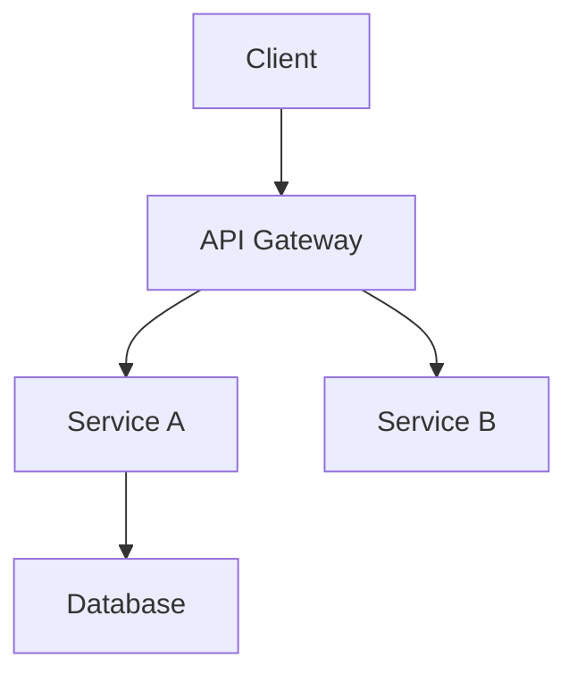

# Full-Stack Scientist Documentation Templates

This file contains the master templates for all documents generated by the Fullstack Scientist skill. Use these as the structural baseline for all output.

---

## 1. PRD Template (Global&Context/PRD.md)
```markdown
# PRD: {{ProjectName}}

### 1. Project Overview
- **Background**: [Brief business background and core pain points]
- **Goal**: [Core business goal]
- **Success Metrics**: [KPIs, e.g., DAU, Conversion Rate, Load Speed]

### 2. User Personas
- **[Role A]**: [Characteristics, Pain Points, Use Cases]
- **[Role B]**: [Characteristics, Pain Points, Use Cases]

### 3. Feature List
| Priority | Feature Module | Description | Notes |
| :--- | :--- | :--- | :--- |
| P0 | Core Feature A | ... | ... |
| P1 | Support Feature B | ... | ... |

### 4. Data Model Overview
- **[Entity A]**: [Field Description, Relationships]
- **[Entity B]**: [Field Description, Relationships]

### 5. Non-Functional Requirements
- **Security**: [Auth, Permissions, Encryption]
- **Performance**: [Response Time < 200ms, Concurrency]
- **Compliance**: [GDPR, Data Privacy]
```

---

## 2. Architecture Template (Global&Context/Architecture.md)
```markdown
# Architecture: {{ProjectName}}

### 1. Tech Stack Selection
- **Frontend**: [Framework, UI Lib, State Mgmt] - *Rationale: ...*
- **Backend**: [Language, Framework] - *Rationale: ...*
- **Database**: [Type, Selection] - *Rationale: ...*
- **DevOps**: [Docker, CI/CD]

### 2. System Diagram


### 3. API Strategy
- **Style**: [REST / GraphQL]
- **Auth**: [JWT / OAuth2 / Session]

### 4. Third-Party Integrations
- **[Service Name]**: [Usage, Provider]
```

---

## 3. Style Guide & Flow Template (Style&Guide/)
```markdown
# Style Guide: {{ProjectName}}

### 1. Color System
- **Primary**: #XXXXXX (Brand Color)
- **Secondary**: #XXXXXX (Accent Color)
- **Neutral**: #XXXXXX (Background/Text)
- **Semantic**: Success(#green), Warning(#yellow), Error(#red)

### 2. Typography
- **Font Family**: [Font Stack]
- **H1**: [Size, Weight]
- **Body**: [Size, Line-height]

### 3. Component Specs
- **Buttons**: [Padding, Radius, Hover Effect]
- **Cards**: [Shadow, Border, Padding]
- **Inputs**: [Focus State, Error State]

---

# Flow Logic: {{ProjectName}}

### 1. Page List
- `[PageID]` **[Page Name]**: [Main Function Description]

### 2. User Journey
1. User opens Home -> Clicks "Register"
2. Fills Form -> Submits -> Validation Fail (Shows Error)
3. Corrects Info -> Submits -> Success -> Redirects to Dashboard

### 3. State Machine
- **Order Status**: Created -> Paid -> Shipped -> Delivered -> Completed
```

---

## 4. User Story Template (Feature&Plan/)
```markdown
# User Story: {{US_ID}} - {{Title}}

### 1. Description
**As a** {{Role}},
**I want to** {{Requirement}},
**So that** {{Value}}.

### 2. Acceptance Criteria
- **Scenario 1: Happy Path**
    - **Given** User is on login page with correct credentials
    - **When** User clicks "Login" button
    - **Then** Redirect to Home and show welcome message

- **Scenario 2: Edge Case**
    - **Given** User enters incorrect password
    - **When** User clicks "Login" button
    - **Then** Stay on current page and show red error "Invalid Password"

### 3. Related Resources
- **Prototype**: `../Screen&Prototype/{{US_ID}}.html`
- **API Endpoint**: `POST /api/login`
```
